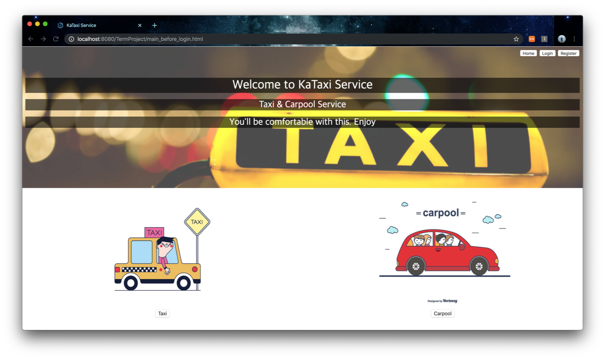
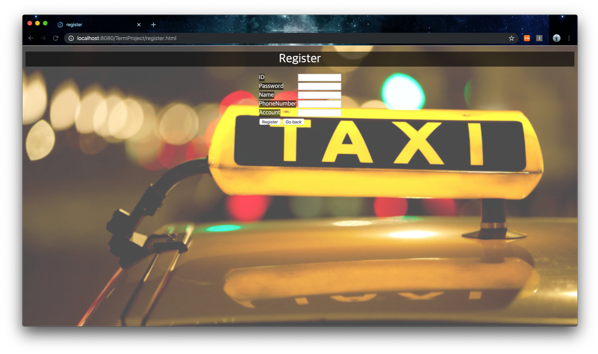
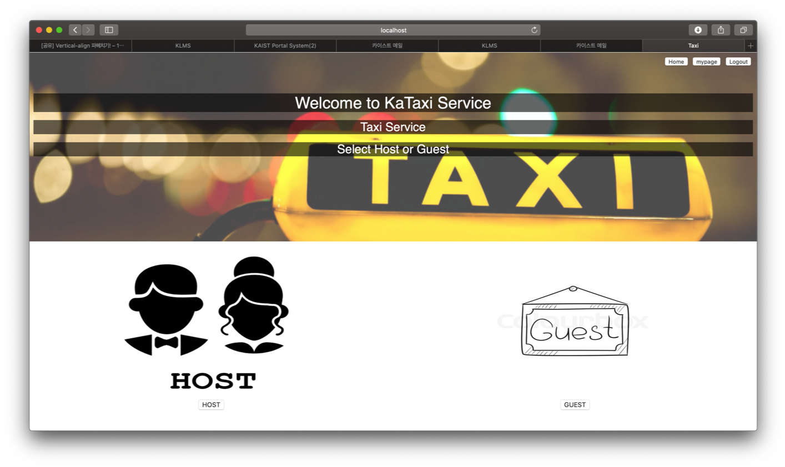
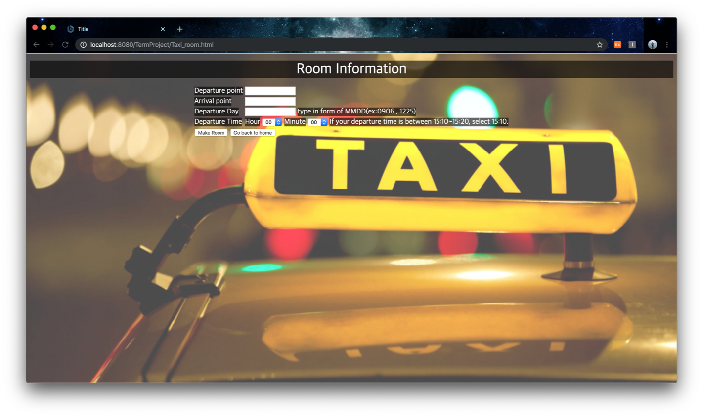

# Taxi_Service_Web

## Local Web : Provide Taxi Service &Carpool Service

Target System
 - Taxi sharing service
 - Car pool service
 
Scenario for taxi Service

1. User sign in
2. User selects taxi service
3. User selects make or join
If make 4. Host provide the room information(time, departure, arrival) to the system.
If join 4. Guest joins the room
5. Host can know the number of guests in room
6. Administrators close the room when the number of guests reach 3 or the time to departure get closes.
7. Host and Guests can know each other’s name, phone number.
8. Administrators make chatting room

Implementing Screen
 - MainPage

 - Register

 - Select Host, Guest

 - Host Screen

 - Guest Mypage

 - Chat System

Other Deatils in PPT. 
